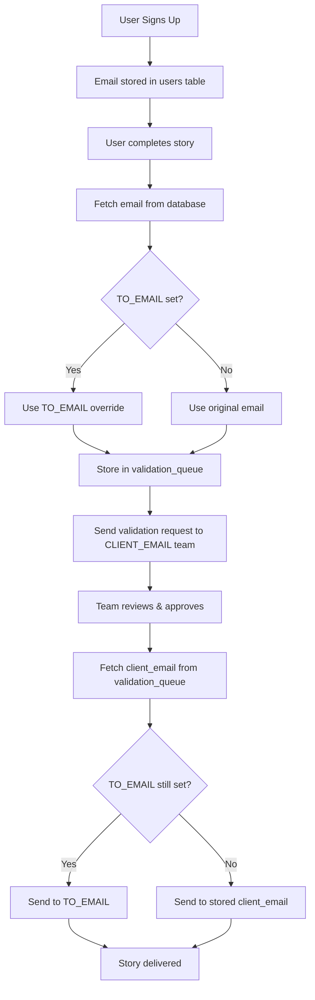

# Email Tracking & Validation Workflow

## Overview
This document explains how client emails are tracked and used in the validation workflow.

## Environment Variables

### Email Configuration
```env
# Resend Service
RESEND_API_KEY=key
FROM_EMAIL=noreply@storiesweetell.com

# Internal Team (Validation Notifications) - REQUIRED
CLIENT_EMAIL=reviewer1@yourteam.com,reviewer2@yourteam.com
```

## Email Flow Architecture

### 1. Client Email Capture
```
Authenticated User Signup → Email stored in `users` table → Used for story delivery
Anonymous Users → No email stored → Requires TO_EMAIL override
```

**Storage Location**: `users.email` field in database (authenticated users only)

**Code**: `app/database/session_service_supabase.py:38-46`

### 2. Story Completion Detection
```
Story Complete → Fetch user email from database → Create validation request
```

**Process**:
1. Story completion detected in chat
2. Fetch user email: `SELECT email FROM users WHERE user_id = ?`
3. Apply `TO_EMAIL` override if set (for testing)
4. Store in validation queue

**Code**: `app/api/simple_chat.py:726-744`

### 3. Validation Queue Storage
```
User Data → validation_queue table → Awaits human review
```

**Database Schema**:
```sql
CREATE TABLE validation_queue (
    validation_id UUID PRIMARY KEY,
    project_id UUID NOT NULL,
    user_id UUID NOT NULL,
    client_email TEXT,           -- Client's email (with TO_EMAIL override)
    client_name TEXT,
    conversation_transcript TEXT,
    generated_script TEXT,
    status TEXT DEFAULT 'pending'
);
```

### 4. Internal Team Notification
```
CLIENT_EMAIL → Internal validation notification → Team reviews
```

**Recipients**: All emails in `CLIENT_EMAIL` environment variable

**Content**: Conversation transcript + generated script + approval links

### 5. Client Delivery (After Approval)
```
Validation approved → Send to client_email → Story + script delivered
```

**Recipient**: `validation_queue.client_email` (may be overridden by `TO_EMAIL`)

## Story Delivery Logic

### How Email Delivery Works
- **Authenticated Users**: Get stories delivered to their signup email (from `users.email`)
- **Anonymous Users**: Stories are validated but NOT delivered (no email available)

### Client Email Flow
- **Internal Team**: Always receives validation requests via `CLIENT_EMAIL`
- **End Users**: Only authenticated users receive final stories

### How It Works

#### During Story Completion
```python
# Get authenticated user's email from database
user_email = fetch_from_users_table(user_id) if is_authenticated else None

# Check if we can deliver the story
if not user_email:
    if not is_authenticated:
        print("⚠️ Anonymous user - story will be validated but not delivered")
    else:
        print("⚠️ Authenticated user but no email found in database")
```

#### During Validation Queue Creation
```python
# Check for override before storing
final_client_email = client_email
to_email_override = os.getenv("TO_EMAIL")
if to_email_override:
    print(f"📧 TO_EMAIL override detected: {to_email_override} (original: {client_email})")
    final_client_email = to_email_override.strip()

# Store overridden email in validation queue
validation_data['client_email'] = final_client_email
```

#### During Client Delivery
```python
# Apply override one more time during delivery (double-check)
final_user_email = user_email
to_email_override = os.getenv("TO_EMAIL")
if to_email_override:
    print(f"📧 TO_EMAIL override for client delivery: {to_email_override} (original: {user_email})")
    final_user_email = to_email_override.strip()

# Send to final email
send_email(to=final_user_email)
```

## Complete Email Workflow



## Usage Examples

### Production Mode
```env
# Resend Service
RESEND_API_KEY=your-resend-key
FROM_EMAIL=noreply@storiesweetell.com

# Internal validation team
CLIENT_EMAIL=reviewer1@yourteam.com,reviewer2@yourteam.com
```

### Result:
- ✅ **Authenticated users**: Get stories delivered to their signup email
- ⚠️ **Anonymous users**: Stories validated but not delivered (encourage signup)
- 📧 **Internal team**: Always gets validation requests

## API Endpoints

### Get Validation Queue
```
GET /api/v1/validation/queue
```

### Approve Validation (Triggers Client Email)
```
POST /api/v1/validation/{validation_id}/approve
{
  "reviewed_by": "reviewer@storiesweetell.com",
  "review_notes": "Approved for client delivery"
}
```

### Update Script Before Approval
```
PUT /api/v1/validation/{validation_id}
{
  "reviewed_by": "editor@storiesweetell.com",
  "updated_script": "Modified script content...",
  "review_notes": "Updated character dialogue"
}
```

## Security & Privacy

### Data Protection
- Client emails encrypted in database
- TO_EMAIL override logged for audit trail
- Original email preserved in logs for troubleshooting

### Access Control
- Validation queue restricted to authenticated team members
- Client delivery only after human approval
- Override capabilities for authorized testing only

## Monitoring & Logging

### Email Tracking Logs

**For Authenticated Users:**
```
📧 Sending validation notification to internal team: ['reviewer1@yourteam.com', 'reviewer2@yourteam.com']
✅ Validation request sent to internal team
✅ Email sent successfully to user@customer.com (ID: re_abc123)
```

**For Anonymous Users:**
```
⚠️ Anonymous user - story will be validated but not delivered (no email available)
📧 Sending validation notification to internal team: ['reviewer1@yourteam.com', 'reviewer2@yourteam.com']
✅ Validation request sent to internal team
```

### Validation Queue Stats
```
GET /api/v1/validation/stats
{
  "pending": 5,
  "approved": 12,
  "sent_to_client": 8,
  "total": 25
}
```
